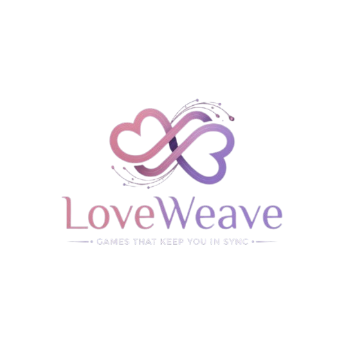

# LoveWeave

Real-time space for long-distance couples. Play together in sync: shared story, daily sparks, love notes, guess about me, and 500 categorized Bridge the Gap questions.

<p align="center">
  
</p>

## Features
- Google sign-in + email invites (live pending invites)
- Pair-based games: auto-reuse thread for same email pair, or force "New Game"
- Our Story with tone selector (Romantic / Fun / Future / Spicy)
- Daily Spark: answer prompt, see partner live
- Love Notes: quick shared messages
- Guess About Me: submit, partner marks true/false, score tracked
- Bridge the Gap: 500 questions across 10 categories (Emotional, Conflict, Values, Future, Family, Intimacy, Growth, Daily Life, Money, Sexual). Random unanswered-first picker, category filter, live partner answers.
- Live Firestore sync (modular SDK), dark UI matching the app

## Assets
- `public/logo.png` — app logo (also used as favicon via `/favicon.png`)
- `public/hero.png` — landing hero image
- `public/loveweave_video.mp4` — short intro loop on landing

## Tech
- Vite + Tailwind (CDN) + Font Awesome
- Firebase Auth (Google) + Firestore (modular SDK)
- No native selects; custom dark dropdowns for tone + bridge category

## Run
```bash
npm install
npm run dev
```

## Build
```bash
npm run build
```

## Seeding Questions
Questions are served from Firestore under `/questions/bridge` (and `/questions/loveSparks`). On first signed-in load the app seeds them from `bridge_the_gap_questions.txt` via `content.js`.

## License
MIT

---

<p align="center">
  
</p>
